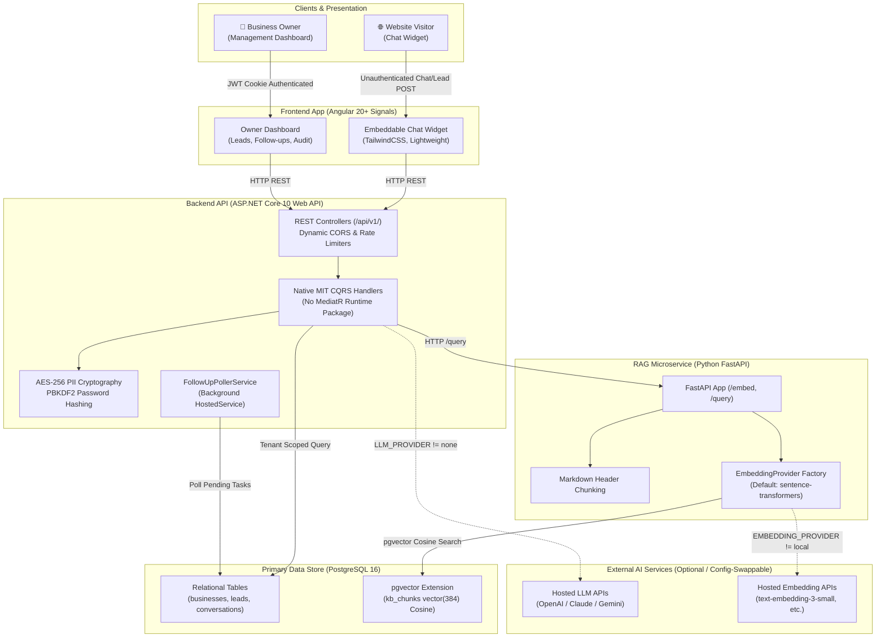

# NeverMissLead — Grounded RAG Lead Capture & Follow-Up Assistant

[](https://github.com/nparvezten/NeverMissLead/actions/workflows/ci.yml)
[](LICENSE)
[](https://dotnet.microsoft.com/)
[](https://angular.dev/)
[](https://python.org/)
[](https://github.com/pgvector/pgvector)

NeverMissLead is a multi-tenant, citation-grounded RAG (Retrieval-Augmented Generation) lead capture and follow-up assistant for independent service businesses (v1 reference niche: **private tutors and coaching classes**). 

Visitors ask questions in an embeddable website widget, receive accurate answers grounded directly in the business's own FAQ and pricing documents with verifiable source citations, and are automatically captured as qualified leads with scheduled follow-up sequences. When a visitor asks an out-of-scope or ungrounded question, the assistant explicitly abstains and flags the conversation for owner handoff rather than hallucinating.

---

## 📊 Grounding Benchmark & Verification Results

Retrieval accuracy and hallucination resistance are verified by an automated evaluation harness (`eval/run_eval.py`). All metrics below are actively computed against an 18-question benchmark suite derived from a real tutoring center FAQ ([`eval/tutor_faq_sample.md`](eval/tutor_faq_sample.md)), containing 12 answerable queries and 6 adversarial/out-of-scope near-misses.

> [!NOTE]
> *Honesty in Engineering*: These metrics reflect evaluation on an 18-case seed benchmark for a single reference business in local $0 CPU mode (`all-MiniLM-L6-v2`), not a statistical claim of universal general-purpose accuracy. See [`eval/latest_report.md`](eval/latest_report.md) for full question-by-question telemetry.

| Evaluation Metric | Target Threshold | Benchmark Result | Status |
|---|:---:|:---:|:---:|
| **Overall Accuracy** | &ge; 85% | **100.0%** (18/18) | ✅ PASS |
| **Answerable Accuracy** | &ge; 80% | **100.0%** (12/12) | ✅ PASS |
| **Citation Precision** | &ge; 90% | **100.0%** (12/12) | ✅ PASS |
| **Abstention Correctness** | &ge; 80% | **100.0%** (6/6) | ✅ PASS |

### Test Suite Verification Matrix

```text
├── xUnit (.NET 10 Backend)     :  40 / 40 Passing  (Clean Architecture, Native CQRS, PBKDF2, Dynamic CORS, Tenant Isolation)
├── Pytest (Python RAG Service) :  22 / 22 Passing  (Recursive chunking, cosine retrieval, Fake/Local providers)
├── Playwright (E2E Browser)    :   4 /  4 Passing  (Widget Q&A, Citation chips, Lead capture form, Owner dashboard)
├── Bandit (Python SAST)        :   0 Issues (0 High, 0 Medium, 0 Low)
└── Full Verification Pipeline  :   6 /  6 Stages Green (./run-pipeline.sh)
```

---

## 🏛️ System Architecture

NeverMissLead is architected as four loosely-coupled, containerized components with tenant-isolated vector retrieval. Detailed architectural sequence diagrams and database ERDs are available in **[docs/diagram/README.md](docs/diagram/README.md)**:



---

## ⚖️ Architecture Decisions & Trade-Offs

### 1. PostgreSQL + `pgvector` vs. Dedicated Vector Database (Pinecone / Weaviate / Qdrant)
- **Decision**: Used standard PostgreSQL with the `pgvector` extension for both relational business data and vector embeddings.
- **Why**: Eliminates distributed multi-database consistency bugs. Tenant isolation is enforced natively via SQL `WHERE business_id = @id AND kd."BusinessId" = @id` in the same transaction boundaries.
- **Trade-off**: For multi-million vector scales, dedicated vector databases offer advanced distributed partitioning; for SMB coaching/tutoring catalogs (100–10,000 chunks), `pgvector` provides superior operational simplicity at zero extra infrastructure cost.

### 2. Native MIT CQRS vs. MediatR v13+ Commercial Package
- **Decision**: Implemented native C# in-process command/query dispatching (`IRequestHandler<TReq, TRes>`) with assembly scanning.
- **Why**: Zero external runtime licensing risk, zero breaking upgrade churn, and full compliance with strict open-source permissive licensing requirements.
- **Trade-off**: Requires maintaining a small 40-line internal `Mediator.cs` registration utility rather than relying on an external ecosystem.

### 3. Provider-Agnostic AI Layer (Local-by-Default, Zero-Cost CI)
- **Decision**: Built abstract `ILlmClient` (.NET) and `EmbeddingProvider` (Python) abstractions with local/stub defaults (`all-MiniLM-L6-v2` CPU + `NullLlmClient`).
- **Why**: The entire project, all unit/integration tests, and CI workflows run at **$0 cost** with **zero API keys required**. Swapping to OpenAI, Anthropic, or Gemini is a single configuration switch (`LLM_PROVIDER=openai`).
- **Trade-off**: Local mode generation is rule-grounded rather than full generative synthesis, requiring real API credentials to demonstrate conversational phrasing nuance.

### 4. Strict Citation Grounding & Abstention vs. Generative Hallucination
- **Decision**: Responses require matching knowledge chunks (`cited_chunk_ids`). Queries without grounding trigger `needsHuman = true` and prompt owner handoff.
- **Why**: In commercial tutoring and service businesses, quoting an incorrect price or promising a non-existent curriculum destroys business credibility. Abstaining safely protects revenue.
- **Trade-off**: The assistant will refuse to answer borderline questions where general knowledge might have guessed correctly.

---

## ⚡ Quickstart Guide

### Method 1: Docker Compose (Recommended)

```bash
git clone https://github.com/nparvezten/NeverMissLead.git
cd NeverMissLead
docker compose up --build
```

- **Chat Widget Demo / Owner Dashboard:** `http://localhost:4200`
- **.NET 10 API:** `http://localhost:5103` (`/swagger` or `/health`)
- **FastAPI RAG Service:** `http://localhost:8000` (`/docs`)

### Method 2: Local Developer Setup

#### Prerequisites
- .NET 10 SDK
- Python 3.11+
- Node.js 20+ & npm
- PostgreSQL 15+ with `pgvector`

```bash
# 1. Start PostgreSQL (e.g. via Docker)
docker compose up -d postgres

# 2. Run Backend API
dotnet run --project backend/API/NeverMissLead.API.csproj --urls "http://localhost:5103"

# 3. Run Python RAG Microservice
cd rag-service
python3 -m venv .venv
source .venv/bin/activate
pip install -r requirements.txt
uvicorn main:app --host 0.0.0.0 --port 8000 --app-dir .

# 4. Run Angular Standalone Frontend
cd ../frontend
npm install
npx ng serve --port 4200
```

---

## 🔑 Demo Sandbox Credentials

The local database is pre-seeded with a complete reference tutoring center:

- **Business Name**: Bright Minds Coaching (`a1b2c3d4-e5f6-7890-abcd-ef1234567890`)
- **Owner Dashboard URL**: `http://localhost:4200` (click "Owner Login")
- **Owner Email**: `owner@brightminds.test`
- **Owner Password**: `BrightMinds2026!`
- **Sample Visitor Conversation**: Open the floating blue widget in the bottom-right corner and ask: *"How much do private 1-on-1 sessions cost?"* or *"Do you teach Grade 11 Biology?"*

### Sample Website Embed Script
Embed NeverMissLead on any customer website with a single `<script>` tag:
```html
<script src="http://localhost:4200/widget.js" data-business-id="a1b2c3d4-e5f6-7890-abcd-ef1234567890"></script>
```

---

## 💸 Cost Model: $0 Free by Default, Client-Ready by Config

NeverMissLead runs entirely free out-of-the-box. To switch from local CPU embeddings and stub LLM to hosted AI providers in production, set environment variables in your deployment environment:

```env
# Embedding Provider Options: 'local' (default) | 'openai' | 'gemini'
EMBEDDING_PROVIDER=openai
OPENAI_API_KEY=sk-...

# LLM Generation Provider Options: 'none' (default) | 'ollama' | 'openai' | 'anthropic' | 'gemini'
LLM_PROVIDER=anthropic
ANTHROPIC_API_KEY=sk-ant-...
```

---

## 🛡️ Security & Tenant Isolation

1. **Cryptographic Password Hashing**: Owner passwords use ASP.NET Core built-in PBKDF2 (`HMAC-SHA512`, 100,000 iterations, 128-bit cryptographically secure salt, and constant-time equality check).
2. **AES-256 Field Encryption**: Lead PII (`name`, `phone`, `email`) is encrypted at rest using AES-256-CBC with HMAC-SHA256 authenticated integrity.
3. **Multi-Tenant Scoping**: All database reads, vector distance searches, lead queries, and conversation logs enforce `WHERE business_id = currentTenantId`.
4. **Dynamic CORS Enforcement**: Public widget requests validate the `Origin` header against the registered business's allowlist stored in PostgreSQL.
5. **Rate Limiting**: Public chat widget (`200 req/min dev`, `30 req/min prod`) and login endpoints (`5 req/min`) prevent brute-force attacks and abuse.
6. **HttpOnly Session Cookies**: JWT session tokens are persisted in `HttpOnly`, `SameSite=Strict`, `Secure` (over HTTPS) cookies.

---

## 🧪 Comprehensive Automated Verification

Execute the complete 6-stage verification pipeline locally in one command:

```bash
./run-pipeline.sh
```

Stages executed:
1. **.NET 10 Build** with `--warnaserror` (0 warnings).
2. **xUnit Suite** (40 tests passing).
3. **Python Pytest Suite** (22 tests passing).
4. **Bandit SAST Security Scan** (0 vulnerabilities).
5. **Angular Production Build** (Zero compilation errors).
6. **RAG Benchmark Evaluation** (`eval/run_eval.py` asserting &ge; 80% thresholds).

---

## 🚧 Known Limitations & Roadmap

- **Single-Business Benchmark**: Current eval harness tests 18 queries against the reference coaching class FAQ. Expanding multi-business eval sets (e.g. accounting, legal, fitness) is scheduled for v1.1.
- **Transactional Dispatcher Stub**: The `FollowUpPollerService` currently logs scheduled follow-up tasks to the timeline; integrating live SendGrid/Postmark transactional email and WhatsApp Cloud API is planned for v2 channel adapters.
- **CORS Allow-List Admin UI**: Business allowed origins are stored and enforced dynamically from `business_settings`, but must currently be managed via API/database rather than a dedicated dashboard UI tab.

---

## 📄 License

Distributed under the **MIT License**. See [`LICENSE`](LICENSE) for details.