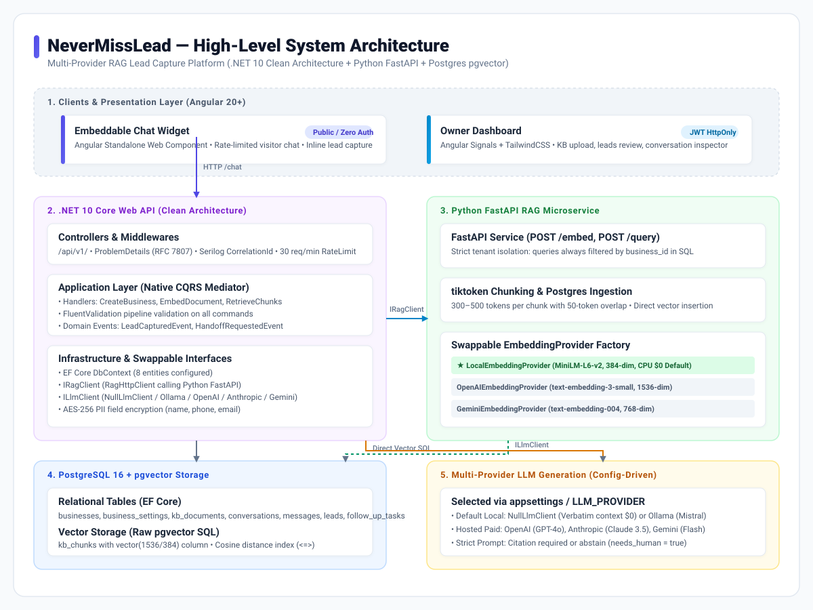
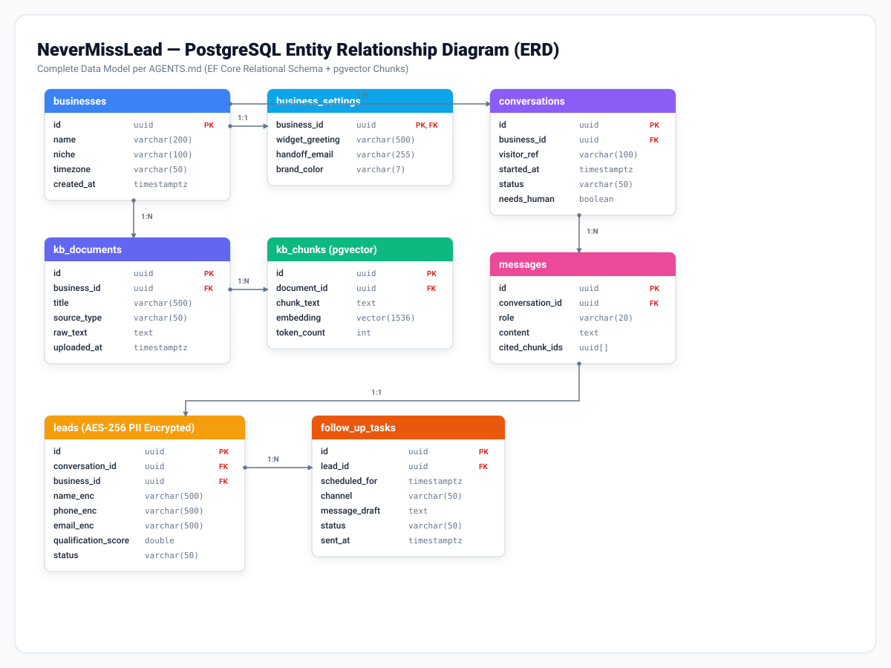
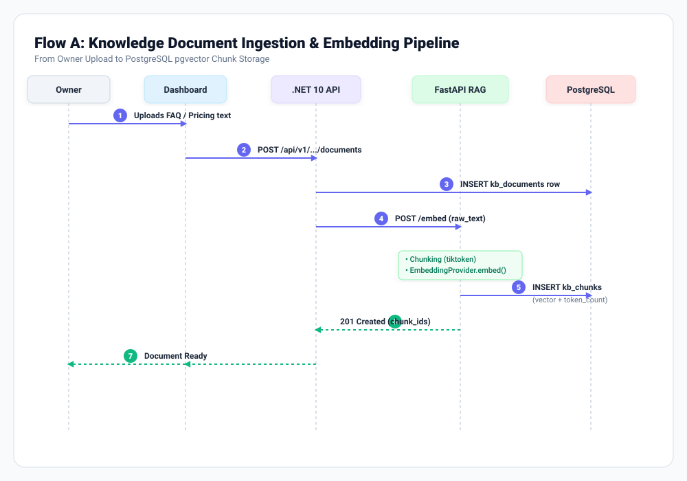
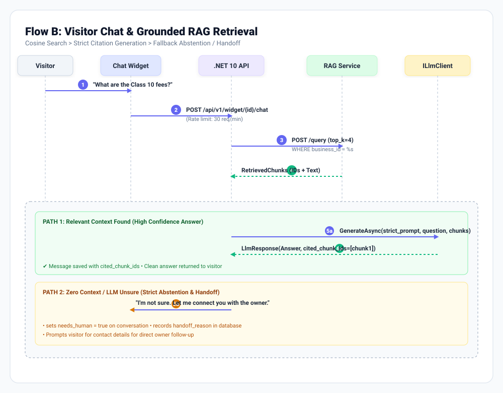
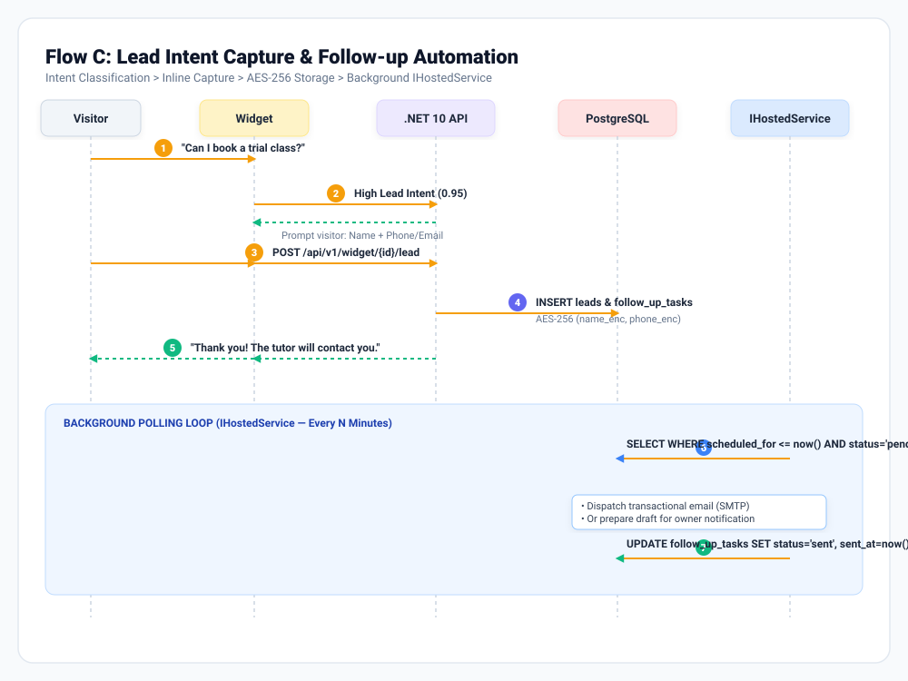

# NeverMissLead — Architecture & Flow Diagrams

This directory contains high-resolution vector diagrams (SVGs) illustrating the system architecture, entity relationships, and core RAG / lead-capture workflows for **NeverMissLead**.

---

## 1. High-Level System Architecture

### Highlights
- **Presentation Layer**: Angular 20+ standalone embeddable chat widget (unauthenticated, public) & owner management dashboard (HttpOnly cookie JWT).
- **Backend**: C# .NET 10 Web API, Clean Architecture, Native CQRS Mediator (`IMediator`, `IRequest<T>`, `IRequestHandler<TReq, TResp>`), FluentValidation, Serilog Correlation IDs, and ProblemDetails.
- **RAG Microservice**: Python FastAPI service owning token-based chunking (`tiktoken`), `EmbeddingProvider` factory (defaulting to local 384-dim CPU model), and tenant-isolated cosine similarity retrieval.
- **Multi-Provider AI Strategy**:
  - **Embeddings**: `LocalEmbeddingProvider` (sentence-transformers `all-MiniLM-L6-v2`, $0 CPU default), `OpenAIEmbeddingProvider`, `GeminiEmbeddingProvider`.
  - **Generation**: Swappable `ILlmClient` (Null stub / Ollama / OpenAI / Anthropic / Gemini via `AiProviders:LlmProvider` configuration).

---

## 2. PostgreSQL Entity-Relationship Diagram (ERD)

### Data Model Rules
- **Tenant Isolation**: Every `kb_documents`, `conversations`, and `leads` row belongs to a `business_id`.
- **Vector Column**: `kb_chunks.embedding` is a native `vector` type in PostgreSQL, queried with cosine distance operator (`<=>`).
- **Data Protection Hygiene**: Lead contact fields (`name_enc`, `phone_enc`, `email_enc`) are encrypted at rest using AES-256.

---

## 3. Core Workflow Sequence Diagrams

### Flow A: Knowledge Base Ingestion & Embedding

1. Owner uploads FAQ / Pricing document through Dashboard.
2. `.NET API` inserts a `kb_documents` record and dispatches raw text to the Python RAG service (`POST /embed`).
3. Python service chunks text via `tiktoken` (300–500 tokens, 50 overlap) and generates dense vectors with `EmbeddingProvider`.
4. Direct `INSERT` into `kb_chunks` with `embedding` vector values.

---

### Flow B: Visitor Chat & Grounded RAG Retrieval

1. Visitor submits a question on the website chat widget.
2. Rate-limited public endpoint `/api/v1/widget/{id}/chat` triggers top-k query to RAG service.
3. RAG service executes cosine similarity search strictly scoped to `business_id`.
4. **Path 1 (High Confidence)**: `ILlmClient` generates an answer strictly from context and attaches cited chunk IDs.
5. **Path 2 (Zero Context / Abstention)**: System abstains to prevent hallucinations, sets `needs_human = true`, and initiates owner handoff.

---

### Flow C: Lead Intent Capture & Follow-up Automation

1. Visitor expresses buying intent (e.g. asking for pricing, enrollment, trials).
2. Intent classifier triggers inline contact form (Name + Phone/Email).
3. Contact details are encrypted (AES-256) and saved in `leads` and `follow_up_tasks`.
4. Domain event `LeadCapturedEvent` is published.
5. Background `IHostedService` poller monitors pending tasks and executes scheduled follow-up notifications.
